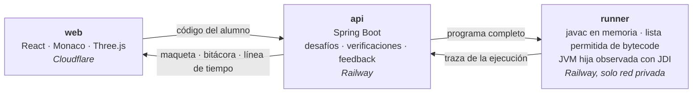

<div align="center">


# Learn Java by Building a University

**Aprendé Java y Programación Orientada a Objetos modelando la UTN real.**<br>
Escribís Java de verdad, lo ejecutás y ves en una maqueta 3D qué construyó tu código.

[**▶ Probalo en ljbu.balbiano06.workers.dev**](https://ljbu.balbiano06.workers.dev)

[](https://github.com/BalbianoLuciano/learn-java-by-building-a-university/actions/workflows/ci.yml)


[](LICENSE)
[](LICENSE-CONTENT.md)

</div>

<picture>
  <source media="(prefers-color-scheme: dark)" srcset="docs/assets/readme/hero-dark.png">
  
</picture>

> 🚧 **Beta.** Los 20 desafíos de los cuatro módulos están publicados y se resuelven de punta a
> punta. Si algo no se entiende o se rompe, [abrí un issue](https://github.com/BalbianoLuciano/learn-java-by-building-a-university/issues/new).

*English: an open source course to learn Java OOP by modeling the real structure of the
Universidad Tecnológica Nacional (Argentina). Write real Java in the browser, run it, and see
what your code built in an isometric 3D model, with feedback tied to your lines of code.
Content is in Spanish for now.*

---

## Cómo funciona

<table>
<tr>
<td width="33%" valign="top">

### 1 · Leés el pedido
Cada desafío es un **pedido de obra** sobre la UTN real: *"Declará una variable `miFacultad`
que apunte a la misma facultad y cargale la provincia por ahí"*.

</td>
<td width="33%" valign="top">

### 2 · Escribís Java
En el editor, con las clases que hagan falta. Le das a **Ejecutar**: se compila y corre en un
servidor, en un sandbox. No hay que instalar nada.

</td>
<td width="33%" valign="top">

### 3 · Ves qué construyó
La **maqueta** muestra tus clases y tus objetos; la **bitácora** explica qué pasó, por qué y
en qué línea; la **línea de tiempo** lo reproduce paso a paso.

</td>
</tr>
</table>

Todo en una sola pantalla: el código a la izquierda, la maqueta y la bitácora a la derecha.

<picture>
  <source media="(prefers-color-scheme: dark)" srcset="docs/assets/readme/workbench-dark.png">
  
</picture>

### La ejecución, paso a paso

Con la línea de tiempo recorrés el programa: la línea se marca en el editor, el objeto que
toca el paso abre su globo con los atributos y el conducto desde su plano se enciende
mientras corre el constructor.

<p align="center">
  
</p>

## Cómo se ve Java

La idea es la de Flexbox Froggy: **cada concepto del lenguaje tiene una sola forma, siempre la
misma, y la forma se parece a lo que significa.**

<table>
<tr>
<td width="55%" valign="top">

| En Java | En la maqueta |
|---|---|
| Clase | **Plano** sobre la mesa del fondo, con la miniatura de lo que construye |
| Objeto | **Edificio** enchufado a su plano, con su chapa `Clase #1`, `#2`… |
| Variable | **Etiqueta** colgada del objeto al que apunta; en el suelo si es `null` |
| Atributos y métodos | **Globo** al tocar el edificio; `private` con candado, `static` con bandera |
| Composición | **Isla adosada**: lo que un objeto tiene vive pegado a él |
| Herencia | **Pisos**: la planta baja es la superclase |
| Interfaz | **Sello** que las clases firman |
| Lo que falta | **Silueta** y andamio |

</td>
<td width="45%" valign="top">


</td>
</tr>
</table>

Cuando algo sale mal, además del mensaje técnico hay una **analogía** ("dicho sin código") y
enlaces a la **documentación oficial de Java** (Tutoriales de Oracle, la JLS y la API) para
profundizar.

## Qué vas a aprender


| Módulo | Temas | Con la UTN real |
|---|---|---|
| **1** · Clases, objetos y referencias | clases, `new`, estado, aliasing, `==`, arreglos | las 30 Facultades Regionales y un único Rectorado |
| **2** · Constructores y encapsulamiento | constructores, `this`, `private`, validación, `static final`, sobrecarga | los requisitos para ser Rector o Decano, mandatos de 4 años |
| **3** · Herencia y composición | `extends`, `super()`, listas, composición antes que herencia | unidades académicas, departamentos, por qué un Decano **no** hereda de Profesor |
| **4** · Polimorfismo e interfaces | clases abstractas, `@Override`, despacho dinámico, interfaces | los órganos de gobierno, el Consejo Superior, quién elige a quién |

Cada módulo es una ruta de cinco desafíos que termina en un integrador.

<p align="center">
  
</p>

## La UTN real, no una inventada

Las 30 Facultades Regionales, el Rectorado, los Consejos, los Decanos y sus requisitos salen
del **Estatuto Universitario** (Res. AU 1/2011) y de las páginas oficiales de la UTN; cada
desafío cita la regla que usa y cada dato tiene su fuente ([dominio](docs/DOMAIN.md)). Las
personas de los desafíos, en cambio, son ficticias.

> Proyecto independiente y de código abierto: **no es un sitio oficial de la UTN**.

## Cómo está hecho



- El **runner** compila el código en memoria, revisa el bytecode contra una lista permitida y
  lo ejecuta en una JVM aparte con límites de tiempo, memoria y pasos, registrando cada paso
  con JDI. Desde Java 24 no existe `SecurityManager`: el aislamiento es en capas
  ([seguridad](docs/SECURITY.md)).
- La **api** nunca ejecuta código: evalúa **verificaciones declarativas** escritas en cada
  `challenge.yaml` sobre la estructura y la traza, y arma la bitácora y la maqueta.
- La **web** dibuja la maqueta con modelos generados por código, sin archivos 3D externos.
- Los contratos entre las tres partes son JSON Schemas en `packages/contracts`.

**Stack:** Java 25 · Spring Boot 4 · JDI · React 19 · TypeScript · Vite · React Three Fiber ·
Monaco · Zustand · pnpm · Docker · Railway · Cloudflare.

## Desarrollo local

Con Docker alcanza para levantar todo:

```bash
docker compose up --build
```

| Qué | Dónde |
|---|---|
| Web | <http://localhost:5173> |
| Api | <http://localhost:8080/api/v1/modules> |
| Runner | sin puerto publicado, igual que en producción |

Para trabajar en un componente hacen falta Node 24 con pnpm (web y contratos) y un JDK 25
(api y runner). Los comandos están en [CONTRIBUTING.md](CONTRIBUTING.md); el deploy, en
[DEPLOY.md](docs/DEPLOY.md).

<details>
<summary><b>Documentación del proyecto</b></summary>

El proyecto sigue Spec-Driven Development: las specs mandan y el código las sigue.

| Documento | Contenido |
|---|---|
| [Producto](docs/PRODUCT.md) | Visión, público, alcance |
| [Dominio](docs/DOMAIN.md) | El modelo de la UTN real y sus fuentes |
| [Currículo](docs/CURRICULUM.md) | Módulos y desafíos |
| [Feedback](docs/FEEDBACK.md) | Cómo se explican los errores y aciertos |
| [Diseño](DESIGN.md) | Contrato visual: interfaz y escena 3D |
| [Arquitectura](docs/ARCHITECTURE.md) | Componentes, contratos, flujo |
| [Seguridad](docs/SECURITY.md) | Cómo se ejecuta código ajeno de forma segura |
| [Formato de desafíos](docs/specs/challenge-format.md) | Cómo se escribe un desafío |
| [Deploy](docs/DEPLOY.md) | Railway, Cloudflare y cómo operarlo |
| [Decisiones (ADR)](docs/adr/) | Por qué se eligió cada cosa |
| [Roadmap](docs/ROADMAP.md) | Hitos |
| [Guía para agentes](AGENTS.md) | Reglas para implementar siguiendo las specs |

</details>

## Contribuir

Las contribuciones son bienvenidas, sobre todo **desafíos nuevos** y **correcciones de los
mensajes de feedback**: si un mensaje te confundió, eso ya es un bug. Leé
[CONTRIBUTING.md](CONTRIBUTING.md).

<p align="center">
  
  <br><sub>Y si te perdés, hay una 404 a la altura.</sub>
</p>

## Licencia

- Código: [MIT](LICENSE).
- Contenido educativo (`content/`, `docs/`): [CC BY-SA 4.0](LICENSE-CONTENT.md).

## Agradecimientos

Inspirado en la cursada de Programación II de la UTN, en
[Flexbox Froggy](https://flexboxfroggy.com/) y en el
[curso de Java de Facundo Uferer](https://facundouferer.ar/cursos/java/).
