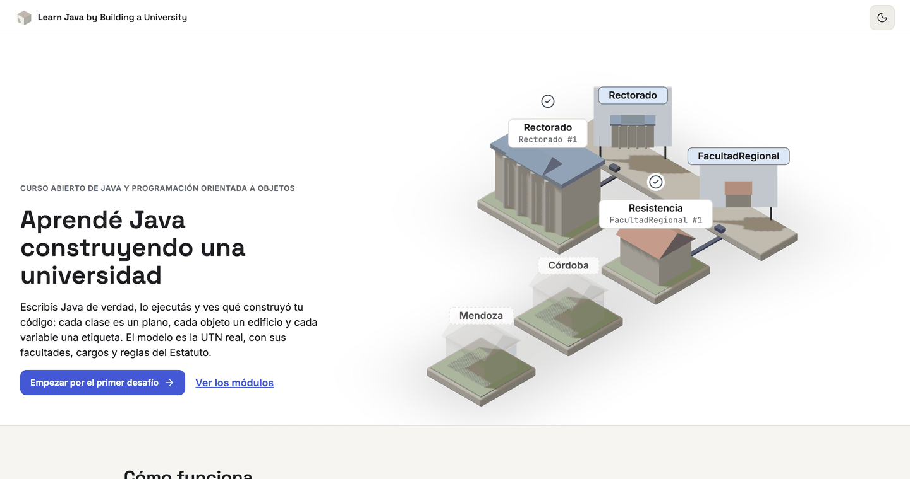
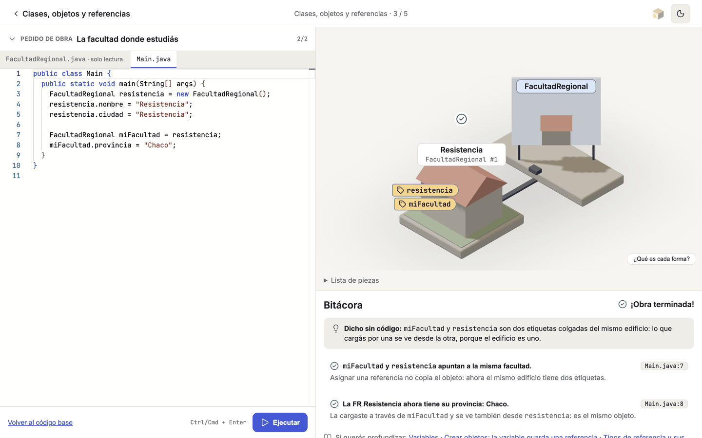
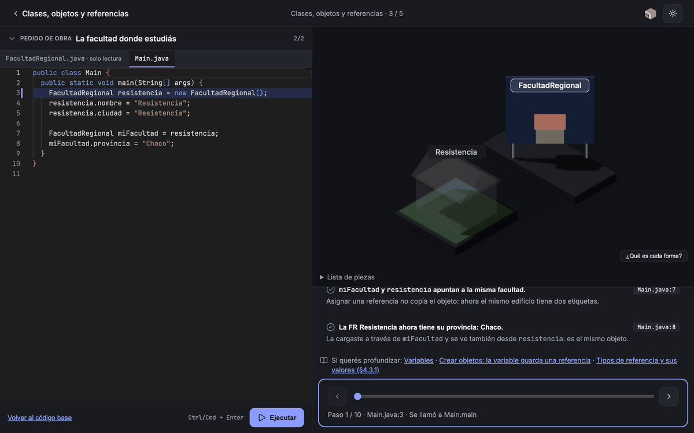
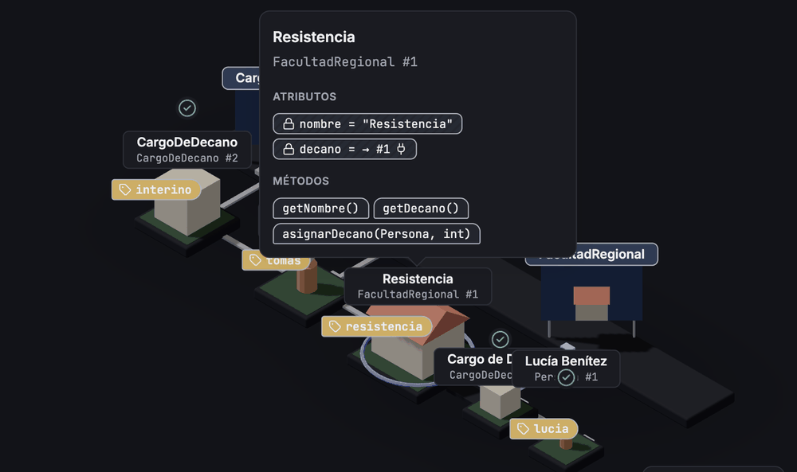
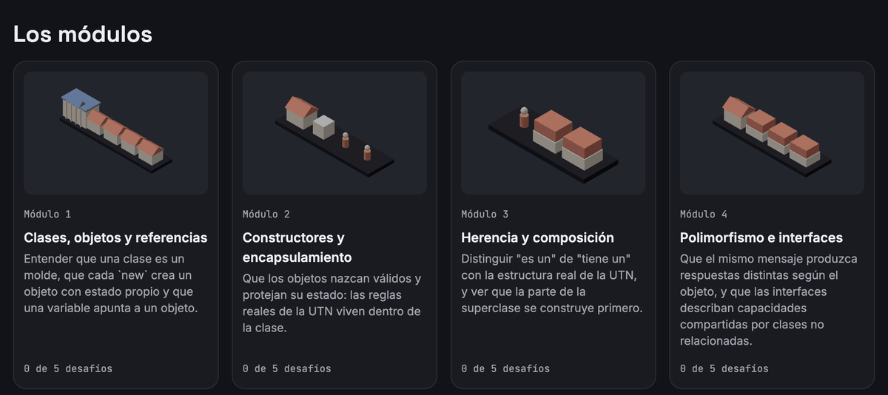
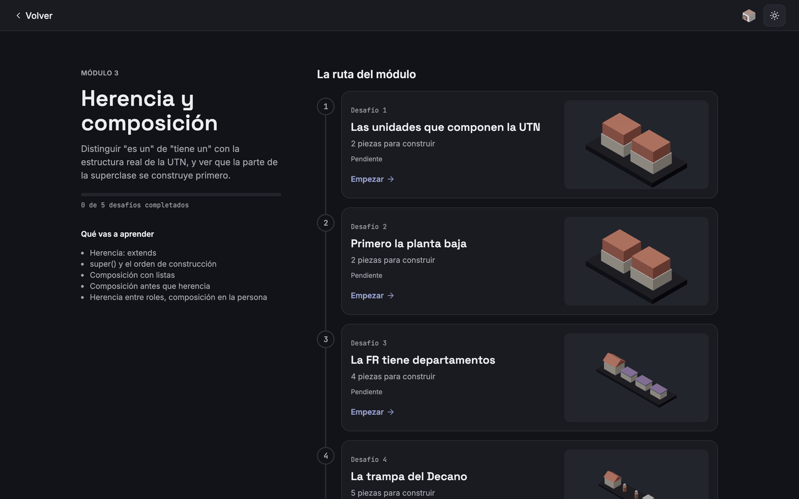
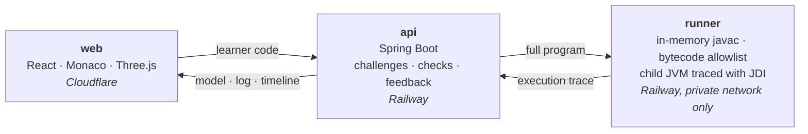
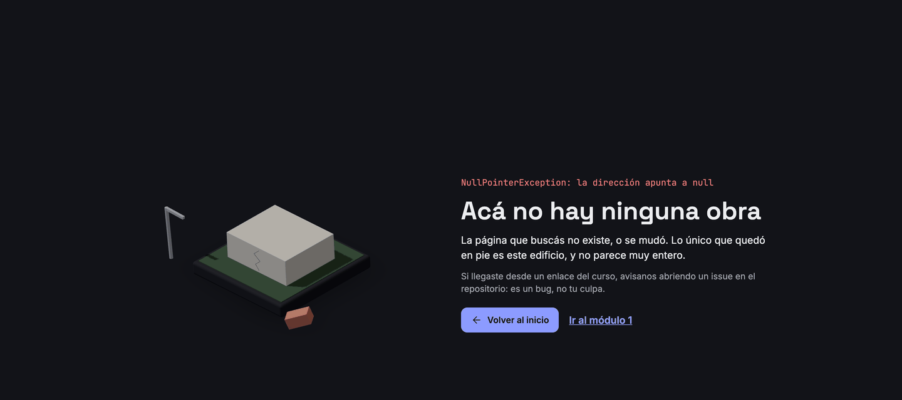

<div align="center">


# Learn Java by Building a University

**Learn Java and Object-Oriented Programming by modeling a real university.**<br>
Write real Java, run it, and see what your code built in a 3D model.

[**▶ Try it at ljbu.balbiano06.workers.dev**](https://ljbu.balbiano06.workers.dev)

[](https://github.com/BalbianoLuciano/learn-java-by-building-a-university/actions/workflows/ci.yml)


[](LICENSE)
[](LICENSE-CONTENT.md)

</div>

<picture>
  <source media="(prefers-color-scheme: dark)" srcset="docs/assets/readme/hero-dark.png">
  
</picture>

> 🚧 **Beta.** All 20 challenges of the four modules are live and can be solved end to end.
> The course content is in **Spanish**, since it is built around the Universidad Tecnológica
> Nacional (UTN), Argentina. If something is confusing or broken,
> [open an issue](https://github.com/BalbianoLuciano/learn-java-by-building-a-university/issues/new).

---

## How it works

<table>
<tr>
<td width="33%" valign="top">

### 1 · Read the brief
Each challenge is a **work order** about the real UTN: *"Declare a variable `miFacultad` that
points to the same faculty and set its province through it"*.

</td>
<td width="33%" valign="top">

### 2 · Write Java
In the editor, with as many classes as you need. Hit **Run**: the code is compiled and
executed on a server, in a sandbox. Nothing to install.

</td>
<td width="33%" valign="top">

### 3 · See what it built
The **model** shows your classes and your objects; the **log** explains what happened, why
and on which line; the **timeline** replays it step by step.

</td>
</tr>
</table>

Everything on one screen: the code on the left, the model and the log on the right.

<picture>
  <source media="(prefers-color-scheme: dark)" srcset="docs/assets/readme/workbench-dark.png">
  
</picture>

### The run, step by step

The timeline walks through the program: the line is highlighted in the editor, the object the
step touches opens its bubble with its attributes, and the conduit from its blueprint lights
up while the constructor runs.

<p align="center">
  
</p>

## What Java looks like

The idea comes from Flexbox Froggy: **every concept of the language has one shape, always the
same, and the shape looks like what it means.**

<table>
<tr>
<td width="55%" valign="top">

| In Java | In the model |
|---|---|
| Class | **Blueprint** on the drafting table, with a miniature of what it builds |
| Object | **Building** plugged into its blueprint, with its plate `Class #1`, `#2`… |
| Variable | **Tag** hanging from the object it points to; on the ground if it is `null` |
| Attributes and methods | **Bubble** when you click the building; `private` with a lock, `static` with a flag |
| Composition | **Attached island**: what an object has lives next to it |
| Inheritance | **Floors**: the ground floor is the superclass |
| Interface | **Seal** that classes sign |
| What is missing | **Silhouette** and scaffolding |

</td>
<td width="45%" valign="top">



</td>
</tr>
</table>

When something goes wrong, besides the technical message there is an **analogy** (the same
idea, explained without code) and links to the **official Java documentation** (Oracle's Java
Tutorials, the JLS and the API) to dig deeper.

## What you will learn



| Module | Topics | With the real UTN |
|---|---|---|
| **1** · Classes, objects and references | classes, `new`, state, aliasing, `==`, arrays | the 30 regional faculties and a single Rectorado |
| **2** · Constructors and encapsulation | constructors, `this`, `private`, validation, `static final`, overloading | the requirements to be Rector or Dean, 4-year terms |
| **3** · Inheritance and composition | `extends`, `super()`, lists, composition over inheritance | academic units, departments, why a Dean does **not** extend Professor |
| **4** · Polymorphism and interfaces | abstract classes, `@Override`, dynamic dispatch, interfaces | the governing bodies, the Consejo Superior, who elects whom |

Each module is a path of five challenges that ends in a capstone.

<p align="center">
  
</p>

## The real UTN, not a made-up one

The 30 regional faculties, the Rectorado, the councils, the deans and their requirements come
from the **University Statute** (Res. AU 1/2011) and from UTN's official pages; every challenge
cites the rule it uses and every fact has a source ([domain](docs/DOMAIN.md)). The people in
the challenges, on the other hand, are fictional.

> An independent, open source project: **not an official UTN site**.

## How it is built



- The **runner** compiles the code in memory, checks the bytecode against an allowlist and runs
  it in a separate JVM with time, memory and step limits, recording every step with JDI. Since
  Java 24 there is no `SecurityManager`: isolation comes in layers ([security](docs/SECURITY.md)).
- The **api** never runs code: it evaluates **declarative checks** written in each
  `challenge.yaml` against the structure and the trace, and builds the log and the model.
- The **web** draws the model with code-generated shapes, no external 3D files.
- The contracts between the three parts are JSON Schemas in `packages/contracts`.

**Stack:** Java 25 · Spring Boot 4 · JDI · React 19 · TypeScript · Vite · React Three Fiber ·
Monaco · Zustand · pnpm · Docker · Railway · Cloudflare.

## Local development

Docker is enough to run everything:

```bash
docker compose up --build
```

| What | Where |
|---|---|
| Web | <http://localhost:5173> |
| Api | <http://localhost:8080/api/v1/modules> |
| Runner | no published port, same as in production |

To work on a component you need Node 24 with pnpm (web and contracts) and a JDK 25 (api and
runner). The commands are in [CONTRIBUTING.md](CONTRIBUTING.md); deployment, in
[DEPLOY.md](docs/DEPLOY.md).

<details>
<summary><b>Project documentation</b> (in Spanish)</summary>

The project follows Spec-Driven Development: the specs lead and the code follows them.

| Document | Contents |
|---|---|
| [Product](docs/PRODUCT.md) | Vision, audience, scope |
| [Domain](docs/DOMAIN.md) | The model of the real UTN and its sources |
| [Curriculum](docs/CURRICULUM.md) | Modules and challenges |
| [Feedback](docs/FEEDBACK.md) | How errors and successes are explained |
| [Design](DESIGN.md) | Visual contract: interface and 3D scene |
| [Architecture](docs/ARCHITECTURE.md) | Components, contracts, flow |
| [Security](docs/SECURITY.md) | How untrusted code is run safely |
| [Challenge format](docs/specs/challenge-format.md) | How a challenge is written |
| [Deploy](docs/DEPLOY.md) | Railway, Cloudflare and how to operate them |
| [Decisions (ADR)](docs/adr/) | Why each thing was chosen |
| [Roadmap](docs/ROADMAP.md) | Milestones |
| [Agent guide](AGENTS.md) | Rules to implement following the specs |

</details>

## Contributing

Contributions are welcome, especially **new challenges** and **fixes to the feedback
messages**: if a message confused you, that is already a bug. Read
[CONTRIBUTING.md](CONTRIBUTING.md).

<p align="center">
  
  <br><sub>And if you get lost, there is a 404 to match.</sub>
</p>

## License

- Code: [MIT](LICENSE).
- Educational content (`content/`, `docs/`): [CC BY-SA 4.0](LICENSE-CONTENT.md).

## Acknowledgements

Inspired by the Programación II course at UTN, by
[Flexbox Froggy](https://flexboxfroggy.com/) and by
[Facundo Uferer's Java course](https://facundouferer.ar/cursos/java/).
